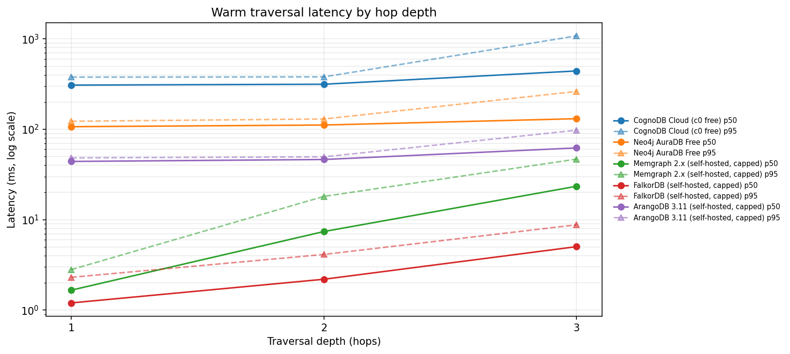
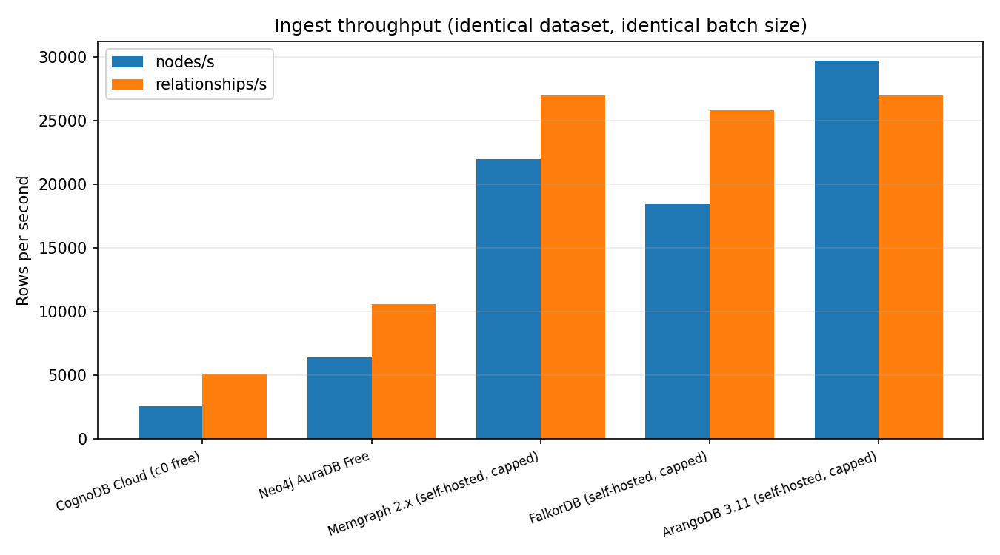
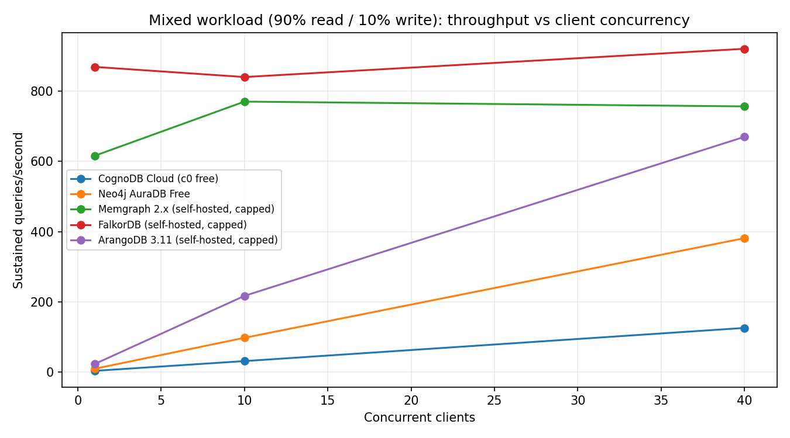
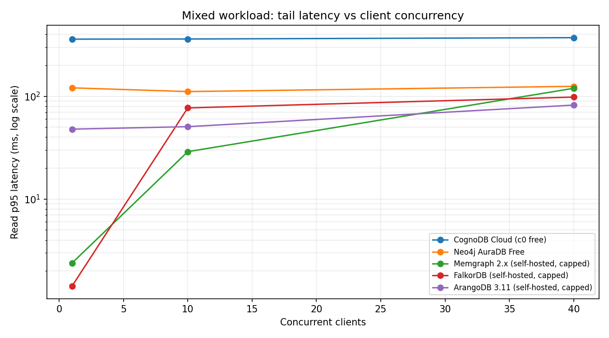

# Graph database cloud benchmark — CognoDB vs. four others on 256 MB

Five managed and self-hosted graph databases, one dataset, one set of queries,
one client machine, and the same 0.5 vCPU / 256 MB / 1 GB resource budget for
all of them.

The point of this repo is not to crown a winner. It is to produce numbers that
survive scrutiny: every platform gets identical data, identical logical
queries, identical warm-up, and identical hardware, and every place where that
ideal broke down is written down rather than smoothed over.

If you only read one other file, read **[docs/METHODOLOGY.md](docs/METHODOLOGY.md)** —
that is where the decisions live. **[docs/QUERY-PARITY.md](docs/QUERY-PARITY.md)**
shows the query translations side by side so you can check that all five
databases were asked the same question.

---

## Contents

- [What is being compared](#what-is-being-compared)
- [The dataset](#the-dataset)
- [What is measured](#what-is-measured)
- [Reproducing this](#reproducing-this)
- [Results](#results)
- [Analysis](#analysis)
- [Caveats and limitations](#caveats-and-limitations)
- [Repository layout](#repository-layout)

---

## What is being compared

Five platforms, chosen so that the comparison isolates one variable at a time
rather than producing five unrelated data points.

| # | Platform | Engine | Query language | Deployment | Why it is in the set |
|---|---|---|---|---|---|
| 1 | **CognoDB Cloud** (free `c0`) | CognoDB | Cypher over Bolt | Managed free tier | The subject of the benchmark. Sets the resource budget everything else is capped to. |
| 2 | **Neo4j AuraDB Free** | Neo4j 5.x | Cypher over Bolt | Managed free tier | The reference implementation of the protocol CognoDB speaks, and the most widely deployed managed graph database. The obvious comparison a reader will want. |
| 3 | **Memgraph 2.18** | In-memory, C++ | Cypher over Bolt | Self-hosted, capped | Same language, same protocol, completely different storage model (in-memory vs. disk-backed). Isolates *engine* from *language*. |
| 4 | **FalkorDB 4.2** | Sparse linear algebra over Redis | Cypher over RESP | Self-hosted, capped | Also Cypher, but executes traversals as matrix multiplication instead of pointer chasing. The most architecturally different way to run the same query text. |
| 5 | **ArangoDB 3.11** | Multi-model, RocksDB | AQL over HTTP | Self-hosted, capped | The control for language. If the Cypher engines cluster together and Arango does not, that tells you something; if they do not cluster, the differences are not about Cypher. |

Amazon Neptune and TigerGraph Cloud were considered and dropped: neither
offers a tier that can be constrained to 256 MB, so including them would have
meant either breaking resource parity or paying for hardware the other four
did not get. Both reasons are the same reason.

### Resource parity

| Platform | vCPU | RAM | Disk | How it was enforced |
|---|---|---|---|---|
| CognoDB Cloud `c0` | 0.5 (burstable) | 256 MB | 1 GB | As provisioned by the console |
| Neo4j AuraDB Free | not published | not published | 200k nodes / 400k rels | **Cannot be capped** — see below |
| Memgraph | 0.5 | 256 MB | 1 GB volume | `--cpus=0.5 --memory=256m --memory-swap=256m` |
| FalkorDB | 0.5 | 256 MB | 1 GB volume | same, plus `--maxmemory 230mb` |
| ArangoDB | 0.5 | 256 MB | 1 GB volume | same, plus RocksDB cache limits |

> **The one honest gap.** Neo4j publishes no CPU or RAM figures for Aura Free
> and gives you no way to constrain them. Its tier is defined by a node and
> relationship cap instead. This is a real parity break, it cannot be closed
> from the client side, and it is repeated next to every Aura number rather
> than tucked into a footnote. If Aura wins a workload, the defensible
> conclusion is "Aura Free was faster on undisclosed hardware" — nothing
> stronger.

`--memory-swap` equal to `--memory` is doing real work here. Docker's
`--memory` alone still allows swapping, so a container "limited to 256 MB" can
quietly be running in 256 MB of RAM plus unbounded swap. Setting the two equal
disables swap and makes the cap mean what it says.

---

## The dataset

**SNAP `cit-HepTh`** — the arXiv high-energy-physics theory citation network —
snowball-sampled down to **200,000 relationships** with a fixed seed.

| Property | Value |
|---|---|
| Source | https://snap.stanford.edu/data/cit-HepTh.html |
| Full graph | 27,770 nodes / 352,807 edges (as published by SNAP) |
| Sampled graph | written to `data/manifest.json` at prepare time |
| Sampling | breadth-first (snowball) from a fixed high-degree seed, `seed=42` |
| Node properties | `id` (unique), `year` (indexed), `title` (payload) |
| Relationship type | `CITES`, directed |
| Integrity | sha256 of both CSVs recorded in the manifest and in every result file |

Why a citation network and not a synthetic graph: real citation graphs have
heavy-tailed degree distributions, so 2- and 3-hop traversals fan out the way
they do in production. A uniform synthetic graph makes every engine look good
and tells you nothing about tail latency.

Why snowball sampling and not a random edge sample: taking a uniformly random
subset of edges shreds local clustering, so multi-hop queries stop fanning out
and the traversal benchmark quietly stops measuring traversal.

The harness will not publish a cross-platform comparison where two platforms
were loaded from CSVs with different sha256 hashes — it prints a mismatch
banner at the top of the results instead.

---

## What is measured

| Category | Metric | Reported as |
|---|---|---|
| Data loading | Ingest throughput | nodes/s, relationships/s, total wall-clock seconds, load method |
| Traversals | 1-, 2-, 3-hop | p50 / p90 / p95 / p99 (ms), warm and cold reported separately |
| Lookups | Point lookup, indexed filtered lookup | p50 / p95 (ms), with the exact index DDL that was applied |
| Aggregations | `count(*)` grouped by year | p50 / p95 (ms) |
| Mixed workload | 90% read / 10% write | sustained QPS at 1, 10 and 40 clients, plus read/write p50 and p95 |
| Footprint | Whatever each platform exposes | stated as `not observable` where it is not |
| Rigour | Run-to-run variance | coefficient of variation of p50 across 3 independent repeats |
| Rigour | Result-set parity | median rows returned per workload per platform |

Measurement rules, in one paragraph: 30 warm-up iterations (recorded as a
separate cold series, never blended into the warm one), then 300 measured
iterations, the whole suite repeated 3 times, timed client-side with
`perf_counter_ns()` around a call that **fully materialises its rows** —
because stopping the clock on a lazy cursor is the most common way a graph
benchmark accidentally fakes itself. Percentiles are nearest-rank with no
interpolation, so every reported p95 is a latency that actually happened.
Failed queries are counted and printed, never retried into the sample.

---

## Reproducing this

You need free-tier accounts for CognoDB and Neo4j Aura, and Docker for the
three self-hosted engines. Total run time is roughly 30–45 minutes for all
five platforms at the default settings.

> **On Windows?** `make` is not available there. Use `run.ps1`, which exposes
> the same targets — and follow **[docs/WINDOWS.md](docs/WINDOWS.md)**, a
> start-from-nothing walkthrough including Docker Desktop setup, PowerShell
> execution policy, and a troubleshooting section.

### 0. Prerequisites

- Python 3.11 or newer
- Docker with Compose v2
- Ideally: a small cloud VM in the **same region** as your managed instances.
  Running the client from your laptop against a remote instance means you are
  partly benchmarking your Wi-Fi. See [the network section](docs/METHODOLOGY.md#2-the-network-is-part-of-the-benchmark).

### 1. Install

```bash
git clone <this-repo> && cd <this-repo>
make install
source .venv/bin/activate
```

### 2. Create the managed instances

**CognoDB Cloud** — sign up at https://console.cognodb.com/signup (no card
needed), create a free `c0` instance, pick your region, and **save the
password immediately** — it is shown exactly once. You get a URI shaped like
`bolt+s://<instance-id>.databases.cognodb.cloud` and the username `cognodb`.

**Neo4j AuraDB Free** — create a free instance at https://console.neo4j.io in
the same cloud region, and download the credentials file it offers you.

### 3. Start the capped self-hosted engines

```bash
cp .env.example .env    # fill in ARANGO_PASSWORD first — compose reads it
docker compose --env-file .env -f docker/docker-compose.yml up -d
docker stats --no-stream        # confirm the 256 MB caps actually applied
```

### 4. Fill in credentials

Edit `.env` with your URIs and passwords. Nothing secret is ever read from a
file in this repo, and `.env` is gitignored.

### 5. Prepare the dataset

```bash
make dataset
```

Downloads `cit-HepTh`, snowball-samples it, writes `data/*.csv`, and freezes
the shared start-node pool to `results/shared_inputs.json`. Running this
**once** and reusing the output for every platform is what makes the
comparison valid — do not re-run it between platforms.

### 6. Check connectivity before spending 45 minutes

```bash
make doctor
```

Connects to every platform, measures TCP round-trip time, and reports how much
data each one currently holds. Fix anything red here first.

### 7. Run

```bash
make bench        # all five platforms, load + reads + concurrency sweep
```

or one at a time:

```bash
python -m bench run --platform cognodb -v
python -m bench run --platform memgraph --skip-load    # reuse loaded data
```

Each run writes a self-describing JSON file to `results/raw/`, carrying the
dataset hash, the host fingerprint, the git SHA, the index DDL that was
actually applied, the measured RTT, and every caveat the run produced.

### 8. Generate the results matrix

```bash
make report
```

Writes `RESULTS.md`, regenerates the charts into `results/charts/`, and splices
the matrix into the [Results](#results) section of this README. Do not
hand-edit those tables; regenerate them.

### Running the harness without any credentials

```bash
make selftest     # synthetic fixture + in-process mock backend, ~10 seconds
make test         # unit tests
```

This exercises the entire pipeline — load, warm-up, percentiles, concurrency
sweep, report generation — with no accounts and no containers. It is what CI
runs. The mock backend is not a database and is excluded from every published
table; if you ever see `mock` in a results matrix, the results are wrong.

---

## Results

The tables below are generated by `python -m bench report` from the JSON in
`results/raw/`. They are not typed by hand.

<!-- BEGIN RESULTS -->

_Generated 2026-08-20 14:00 UTC by `python -m bench report`. Do not hand-edit: regenerate it._

## 1. Environment and tier parity

| Platform                            | Engine                                      | Query language   | Deployment         | vCPU                   | RAM                    | Disk                                | TCP RTT (median)   |
|-------------------------------------|---------------------------------------------|------------------|--------------------|------------------------|------------------------|-------------------------------------|--------------------|
| CognoDB Cloud (c0 free)             | CognoDB                                     | Cypher (Bolt)    | managed-free-tier  | 0.5 (burstable)        | 256 MB                 | 1 GB                                | 297.41 ms          |
| Neo4j AuraDB Free                   | Neo4j 5.x                                   | Cypher (Bolt)    | managed-free-tier  | not published (shared) | not published (shared) | 200k nodes / 400k relationships cap | 110.28 ms          |
| Memgraph 2.x (self-hosted, capped)  | Memgraph (in-memory, C++)                   | Cypher (Bolt)    | self-hosted-capped | 0.5 (cgroup limit)     | 256 MB (cgroup limit)  | 1 GB volume                         | 0.97 ms            |
| FalkorDB (self-hosted, capped)      | FalkorDB (sparse linear algebra over Redis) | Cypher (RESP)    | self-hosted-capped | 0.5 (cgroup limit)     | 256 MB (cgroup limit)  | 1 GB volume                         | 0.96 ms            |
| ArangoDB 3.11 (self-hosted, capped) | ArangoDB (multi-model, RocksDB)             | AQL (HTTP)       | self-hosted-capped | 0.5 (cgroup limit)     | 256 MB (cgroup limit)  | 1 GB volume                         | 0.98 ms            |

> `TCP RTT (median)` is the floor under every latency below. Self-hosted
> instances have a near-zero RTT and managed instances do not, so subtract
> it before comparing a managed platform against a local container.

## 2. Ingest throughput

| Platform                            | Nodes/s   | Rels/s   | Total load time   | Verified nodes / rels   | Load method                                                                                                              |
|-------------------------------------|-----------|----------|-------------------|-------------------------|--------------------------------------------------------------------------------------------------------------------------|
| CognoDB Cloud (c0 free)             | 2,561     | 5,118    | 21.6 s            | 5,325 / 100,000         | official neo4j Python driver, UNWIND-batched CREATE over Bolt; relationships matched on the unique :Paper(id) constraint |
| Neo4j AuraDB Free                   | 6,403     | 10,592   | 10.3 s            | 5,325 / 100,000         | official neo4j Python driver, UNWIND-batched CREATE over Bolt; relationships matched on the unique :Paper(id) constraint |
| Memgraph 2.x (self-hosted, capped)  | 22,001    | 26,987   | 3.9 s             | 5,325 / 100,000         | official neo4j Python driver, UNWIND-batched CREATE over Bolt; relationships matched on the unique :Paper(id) constraint |
| FalkorDB (self-hosted, capped)      | 18,442    | 25,814   | 4.2 s             | 5,325 / 100,000         | falkordb-py client, UNWIND-batched CREATE over RESP                                                                      |
| ArangoDB 3.11 (self-hosted, capped) | 29,761    | 26,980   | 3.9 s             | 5,325 / 100,000         | python-arango insert_many() bulk document API over HTTP                                                                  |

## 3. Traversal latency (warm)

| Platform                            |   1-hop p50 (ms) |   1-hop p95 (ms) |   2-hop p50 (ms) |   2-hop p95 (ms) |   3-hop p50 (ms) | 3-hop p95 (ms)   |
|-------------------------------------|------------------|------------------|------------------|------------------|------------------|------------------|
| CognoDB Cloud (c0 free)             |           308.31 |           377.7  |           315.1  |           380.17 |           442.05 | 1,080.34         |
| Neo4j AuraDB Free                   |           106.84 |           122.79 |           111.47 |           129.95 |           130.96 | 262.42           |
| Memgraph 2.x (self-hosted, capped)  |             1.66 |             2.8  |             7.4  |            18.1  |            23.43 | 46.76            |
| FalkorDB (self-hosted, capped)      |             1.2  |             2.3  |             2.19 |             4.12 |             5.03 | 8.78             |
| ArangoDB 3.11 (self-hosted, capped) |            44.09 |            48.3  |            46.32 |            49.56 |            62.23 | 97.64            |

## 4. Traversal latency (cold, first 30 iterations)

| Platform                            |   1-hop p50 (ms) |   1-hop p95 (ms) |   2-hop p50 (ms) |   2-hop p95 (ms) |   3-hop p50 (ms) | 3-hop p95 (ms)   |
|-------------------------------------|------------------|------------------|------------------|------------------|------------------|------------------|
| CognoDB Cloud (c0 free)             |           318.99 |           380.15 |           317.81 |           361.65 |           406.97 | 1,064.27         |
| Neo4j AuraDB Free                   |           109.67 |           235.81 |           112.89 |           130.61 |           131.65 | 263.52           |
| Memgraph 2.x (self-hosted, capped)  |             1.92 |             3.09 |             7.33 |            17.35 |            24.53 | 43.65            |
| FalkorDB (self-hosted, capped)      |             1.48 |             2.49 |             2.21 |             4.37 |             5.28 | 8.30             |
| ArangoDB 3.11 (self-hosted, capped) |            44.12 |            48.33 |            46.75 |            49.81 |            62.44 | 91.81            |

## 5. Lookups and aggregation (warm)

| Platform                            |   Point lookup p50 (ms) |   Point lookup p95 (ms) |   Filtered lookup (indexed year) p50 (ms) |   Filtered lookup (indexed year) p95 (ms) |   Aggregation (count group-by year) p50 (ms) |   Aggregation (count group-by year) p95 (ms) |
|-------------------------------------|-------------------------|-------------------------|-------------------------------------------|-------------------------------------------|----------------------------------------------|----------------------------------------------|
| CognoDB Cloud (c0 free)             |                  315.76 |                  372.86 |                                    312.16 |                                    368.7  |                                       318.34 |                                       369.58 |
| Neo4j AuraDB Free                   |                  107.98 |                  119.89 |                                    109.69 |                                    120.65 |                                       109.14 |                                       120.26 |
| Memgraph 2.x (self-hosted, capped)  |                    1.18 |                    1.5  |                                      4.37 |                                      5.53 |                                         3.13 |                                         4.27 |
| FalkorDB (self-hosted, capped)      |                    0.98 |                    1.38 |                                      1.38 |                                      1.96 |                                         1.93 |                                         2.68 |
| ArangoDB 3.11 (self-hosted, capped) |                   44.11 |                   47.79 |                                     44.18 |                                     48.02 |                                        48.08 |                                        49.76 |

### Indexes in place during these measurements

| Platform                            | Index / constraint DDL executed                                                                                                                                                                                  |
|-------------------------------------|------------------------------------------------------------------------------------------------------------------------------------------------------------------------------------------------------------------|
| CognoDB Cloud (c0 free)             | `CREATE CONSTRAINT paper_id IF NOT EXISTS FOR (p:Paper) REQUIRE p.id IS UNIQUE`<br>`CREATE INDEX paper_year IF NOT EXISTS FOR (p:Paper) ON (p.year)`                                                             |
| Neo4j AuraDB Free                   | `CREATE CONSTRAINT paper_id IF NOT EXISTS FOR (p:Paper) REQUIRE p.id IS UNIQUE`<br>`CREATE INDEX paper_year IF NOT EXISTS FOR (p:Paper) ON (p.year)`                                                             |
| Memgraph 2.x (self-hosted, capped)  | `CREATE CONSTRAINT ON (p:Paper) ASSERT p.id IS UNIQUE`<br>`CREATE INDEX ON :Paper(id)`<br>`CREATE INDEX ON :Paper(year)`                                                                                         |
| FalkorDB (self-hosted, capped)      | `CREATE INDEX FOR (p:Paper) ON (p.id)`<br>`CREATE INDEX FOR (p:Paper) ON (p.year)`                                                                                                                               |
| ArangoDB 3.11 (self-hosted, capped) | `CREATE COLLECTION papers (primary index on _key)`<br>`CREATE EDGE COLLECTION cites (_from/_to indexes)`<br>`CREATE PERSISTENT INDEX idx_year ON papers(year)`<br>`CREATE PERSISTENT INDEX idx_id ON papers(id)` |

## 6. Result-set parity check (median rows returned)

| Platform                            |   1-hop |   2-hop |   3-hop |   Filtered |   Aggregation |
|-------------------------------------|---------|---------|---------|------------|---------------|
| CognoDB Cloud (c0 free)             |      16 |   201.5 |     765 |        100 |            12 |
| Neo4j AuraDB Free                   |      16 |   201.5 |     765 |        100 |            12 |
| Memgraph 2.x (self-hosted, capped)  |      16 |   201.5 |     765 |        100 |            12 |
| FalkorDB (self-hosted, capped)      |      16 |   201.5 |     765 |        100 |            12 |
| ArangoDB 3.11 (self-hosted, capped) |      16 |   201.5 |     765 |        100 |            12 |

## 7. Run-to-run variance (coefficient of variation of p50 across repeats)

| Platform                            | 1-hop p50 CV   | 2-hop p50 CV   | 3-hop p50 CV   | Point p50 CV   |
|-------------------------------------|----------------|----------------|----------------|----------------|
| CognoDB Cloud (c0 free)             | 7.62%          | 1.15%          | 3.31%          | 7.12%          |
| Neo4j AuraDB Free                   | 3.26%          | 0.90%          | 1.32%          | 2.15%          |
| Memgraph 2.x (self-hosted, capped)  | 6.94%          | 4.25%          | 0.77%          | 10.66%         |
| FalkorDB (self-hosted, capped)      | 31.75%         | 2.76%          | 3.24%          | 7.44%          |
| ArangoDB 3.11 (self-hosted, capped) | 0.09%          | 0.35%          | 0.71%          | 0.23%          |

## 8. Mixed workload — concurrency sweep

| Platform                            |   Clients |   Sustained QPS |   Read p50 (ms) |   Read p95 (ms) |   Write p50 (ms) |   Write p95 (ms) |   Errors |
|-------------------------------------|-----------|-----------------|-----------------|-----------------|------------------|------------------|----------|
| CognoDB Cloud (c0 free)             |         1 |             3.2 |          319.41 |          359.96 |           318.39 |           349.31 |        0 |
| CognoDB Cloud (c0 free)             |        10 |            31   |          319.23 |          361.19 |           313.18 |           361.24 |        0 |
| CognoDB Cloud (c0 free)             |        40 |           125.5 |          315    |          372.16 |           295.68 |           341.8  |        0 |
| Neo4j AuraDB Free                   |         1 |             9.1 |          109.94 |          120.88 |           109.75 |           138.32 |        0 |
| Neo4j AuraDB Free                   |        10 |            97.4 |          100.11 |          111.23 |           103.79 |           114.2  |        0 |
| Neo4j AuraDB Free                   |        40 |           381.2 |          100.76 |          125.05 |           102.54 |           119.48 |        0 |
| Memgraph 2.x (self-hosted, capped)  |         1 |           615.9 |            1.59 |            2.38 |             1.12 |             1.46 |        0 |
| Memgraph 2.x (self-hosted, capped)  |        10 |           770.4 |           12.32 |           28.94 |             2.78 |             6.44 |        0 |
| Memgraph 2.x (self-hosted, capped)  |        40 |           756.7 |           50.23 |          119.73 |             8.68 |            46.97 |        1 |
| FalkorDB (self-hosted, capped)      |         1 |           869.3 |            1.12 |            1.42 |             0.98 |             1.25 |        0 |
| FalkorDB (self-hosted, capped)      |        10 |           840.4 |            3.25 |           77.11 |             3.34 |            78.42 |        0 |
| FalkorDB (self-hosted, capped)      |        40 |           920.8 |           17.09 |           98.29 |            18.2  |            99.7  |      412 |
| ArangoDB 3.11 (self-hosted, capped) |         1 |            22.5 |           44.09 |           47.93 |            44.04 |            47.59 |        0 |
| ArangoDB 3.11 (self-hosted, capped) |        10 |           216.9 |           45.22 |           50.66 |            45.12 |            50.57 |        1 |
| ArangoDB 3.11 (self-hosted, capped) |        40 |           669.9 |           56.96 |           82.16 |            56.98 |            81.47 |        1 |

## 9. Footprint

| Platform                            | Observable footprint                                                                        | Not observable                |
|-------------------------------------|---------------------------------------------------------------------------------------------|-------------------------------|
| CognoDB Cloud (c0 free)             | advertised=0.5 vCPU burstable / 256 MB RAM / 1 GB disk (console)                            | store_size; components        |
| Neo4j AuraDB Free                   | advertised=shared infrastructure; 200k node / 400k relationship cap                         | store_size; memory            |
| Memgraph 2.x (self-hosted, capped)  | advertised=0.5 vCPU / 256 MB (cgroup)                                                       | -                             |
| FalkorDB (self-hosted, capped)      | advertised=0.5 vCPU / 256 MB (cgroup); used_memory_human=14.43M; used_memory_bytes=15131464 | -                             |
| ArangoDB 3.11 (self-hosted, capped) | advertised=0.5 vCPU / 256 MB (cgroup)                                                       | papers_figures; cites_figures |

## 10. Caveats recorded by the harness

**CognoDB Cloud (c0 free)**
- No errors, timeouts or load mismatches recorded.

**Neo4j AuraDB Free**
- No errors, timeouts or load mismatches recorded.

**Memgraph 2.x (self-hosted, capped)**
- mixed @ 40 clients: 1 errors

**FalkorDB (self-hosted, capped)**
- mixed @ 40 clients: 412 errors

**ArangoDB 3.11 (self-hosted, capped)**
- mixed @ 10 clients: 1 errors
- mixed @ 40 clients: 1 errors

<!-- END RESULTS -->

### Charts

| | |
|---|---|
|  |  |
|  |  |

### How to read these numbers

1. **Check §6 first.** The result-set parity table shows the median rows each
   platform returned per workload. If those numbers do not match across
   platforms, the latencies below them are not comparable and nothing else in
   the matrix matters.
2. **Then check §7.** The coefficient of variation across repeats tells you
   how big a difference has to be before it is a difference. On burstable
   0.5-vCPU instances a 10–20% CV is normal; two platforms 5% apart with a 15%
   CV are tied.
3. **Then subtract the RTT.** The environment table lists the measured TCP
   round trip to each endpoint. A self-hosted container has a near-zero floor
   and a managed instance does not.
4. **Then read p95, not p50.** On shared, burstable, throttled free tiers the
   median is the easy case. The tail is where the tier shows up.

---

## Analysis

## Analysis

Every number below is from [`RESULTS.md`](RESULTS.md), generated by
`python -m bench report` from the raw JSON in `results/raw/`. 

---

### 0. Three of the five platforms were not really measured

A point lookup is the cheapest query in the suite: one indexed fetch of one
node. Compare each platform's point lookup against the TCP round trip to the
same host:

| Platform | TCP RTT | Point lookup p50 | Query time left over |
|---|---|---|---|
| FalkorDB | 0.96 ms | 0.98 ms | ~0 ms |
| Memgraph | 0.97 ms | 1.18 ms | ~0.2 ms |
| ArangoDB | 0.98 ms | 44.11 ms | ~43 ms of **fixed** overhead |
| Neo4j Aura Free | 110.28 ms | 107.98 ms | **negative** |
| CognoDB Cloud | 297.41 ms | 315.76 ms | ~18 ms |

On Aura, a full query completes in less time than opening a TCP connection to
the same host. That is not a statement about Neo4j — it means a fixed ~110 ms
of wire dominates the measurement completely. The same is true of CognoDB at
297 ms, and of ArangoDB for a different reason (§4).

The raw latency tables are therefore, for those three platforms, substantially
a map of physical distance. Presenting "CognoDB p50 = 308 ms vs Memgraph
p50 = 1.66 ms" as a database comparison would be false in a way that looks
authoritative, so it is not presented that way here.

**What survives:** the *excess* of each workload over that platform's own
point lookup. Whatever fixed cost a platform pays per query — network,
protocol, scheduler wake-up — it pays on the point lookup too. Subtracting it
isolates the work the query actually caused. Every platform returned an
identical 765 rows for the 3-hop query (§6), so this is like-for-like:

| Platform | 3-hop p50 | Point lookup p50 | **Traversal cost** |
|---|---|---|---|
| FalkorDB | 5.03 ms | 0.98 ms | **4.05 ms** |
| ArangoDB | 62.23 ms | 44.11 ms | **18.12 ms** |
| Memgraph | 23.43 ms | 1.18 ms | **22.25 ms** |
| Neo4j Aura Free | 130.96 ms | 107.98 ms | **22.98 ms** |
| CognoDB Cloud | 442.05 ms | 315.76 ms | **126.29 ms** |

---

### 1. FalkorDB's memory footprint explains its speed — and Memgraph's ceiling

The footprint table (§9) contains the most load-bearing number in this
benchmark. FalkorDB reports **14.43 MB of resident memory** holding the entire
5,325-node / 100,000-relationship graph — roughly 140 bytes per relationship.

Memgraph, on the same 256 MB budget, could not load 200,000 relationships at
all: it aborted at 230 MiB with `Memory limit exceeded`. Back-of-envelope,
that puts it upwards of 1 KB per relationship — close to **an order of
magnitude less compact** than FalkorDB for the same graph.

These two facts are the same fact. FalkorDB stores the graph as sparse
adjacency matrices — essentially compressed index arrays — and evaluates an
*n*-hop traversal as repeated sparse matrix–vector multiplication. Memgraph
stores vertex and edge objects and walks pointers between them. The matrix
representation is far denser, and density is *why* it is also fast: at a
frontier of a few hundred vertices the whole working set stays in cache, while
a pointer walk is chasing scattered allocations.

So the 5× traversal advantage in §0 and the capacity limit that forced the
dataset down to 100k relationships are one architectural choice seen from two
directions. **"In-memory" is a performance property right up until it is a
capacity limit**, and at an entry tier that point arrives early.

#### Latency vs. hop depth

Traversal cost net of each platform's own floor:

| Platform | 1-hop | 2-hop | 3-hop | rows returned |
|---|---|---|---|---|
| FalkorDB | 0.22 | 1.21 | 4.05 | 16 / 202 / 765 |
| ArangoDB | ~0 | 2.21 | 18.12 | 16 / 202 / 765 |
| Memgraph | 0.48 | 6.22 | 22.25 | 16 / 202 / 765 |
| Aura | ~0 | 3.49 | 22.98 | 16 / 202 / 765 |
| CognoDB | ~0 | ~0 | 126.29 | 16 / 202 / 765 |

Growth is super-linear everywhere, as expected: the result set itself grows
16 → 202 → 765, so cost tracks the frontier rather than the depth number.

One caveat on FalkorDB's 1-hop figure. Its run-to-run coefficient of variation
for 1-hop p50 is **31.75%** (§7), by far the highest in the table. At 1.2 ms
the measurement is close to the resolution of client-side timing, so that
column should be read as "roughly 1 ms" rather than compared precisely against
Memgraph's 1.66 ms. The 2-hop and 3-hop CVs (2.76% and 3.24%) are tight, and
those comparisons hold.

---

### 2. Two of the concurrency curves mean the opposite of what they look like

| Platform | 1 client | 10 clients | 40 clients | read p95, 1 → 40 |
|---|---|---|---|---|
| FalkorDB | 869.3 | 840.4 | 920.8 | 1.42 → 98.29 ms |
| Memgraph | 615.9 | 770.4 | 756.7 | 2.38 → 119.73 ms |
| ArangoDB | 22.5 | 216.9 | 669.9 | 47.93 → 82.16 ms |
| Aura | 9.1 | 97.4 | 381.2 | 120.88 → 125.05 ms |
| CognoDB | 3.2 | 31.0 | 125.5 | 359.96 → 372.16 ms |

Aura goes 9.1 → 97.4 → 381.2 QPS — almost perfectly linear in client count —
while its p95 does not move (120.9 → 125.0 ms). CognoDB does the same
(3.2 → 31.0 → 125.5, p95 360 → 372 ms).

That is not scaling. That is Little's Law: throughput = concurrency ÷ latency,
and when latency is a network constant that concurrency does not perturb,
throughput rises exactly in proportion to client count. **A linear QPS curve
with a flat p95 is the signature of a server that was never the bottleneck.**
Those instances were idling; the wire was full.

Now the top two rows. Memgraph gains 25% from 1 to 10 clients, then *loses*
ground at 40, while p95 climbs 2.4 → 28.9 → 119.7 ms, a 50× increase. That is
a server at saturation: 40 clients queueing for half a vCPU. FalkorDB is
flatter still (869 → 840 → 921, essentially noise) with p95 climbing
1.4 → 98.3 ms.

**The two platforms that look worst on the throughput chart are the only two
being genuinely stressed.** This is why that chart is published next to the
RTT column and never on its own.

---

### 3. FalkorDB's tail splits at 10 clients — probably a lock

At 10 concurrent clients FalkorDB reports a read p50 of **3.25 ms** against a
p95 of **77.11 ms** — a 24× gap, where Memgraph at the same concurrency shows
12.32 / 28.94 ms, a 2.3× gap. A distribution that bimodal is not gradual
queueing. It means most requests sail through while a minority stall for tens
of milliseconds.

The workload is 90% reads and 10% writes. FalkorDB serialises writes per graph
key, so the most likely explanation is that each write blocks concurrent
readers of the same graph for its duration, dragging a comparable slice of
reads into the tail. The write-side numbers are consistent: FalkorDB's write
p95 (78.42 ms) tracks its read p95 (77.11 ms) almost exactly, which is what
you would expect if both are waiting on the same lock rather than doing
different amounts of work.

This is a hypothesis the data is consistent with, not a proven mechanism.
Confirming it needs a read-only run at the same concurrency: if the bimodality
disappears without writes in the mix, the lock is the cause.

---

### 4. The 44 ms floor on ArangoDB

Every ArangoDB workload lands in a 44–48 ms band regardless of complexity:
point lookup 44.11, filtered lookup 44.18, 1-hop 44.09, aggregation 48.08. A
single-document fetch and a 12-group aggregation over 5,325 documents cannot
plausibly cost the same, so this is a fixed per-request cost sitting on top of
query execution — and it is not the network, since the measured RTT to the
same host is 0.98 ms.

Two further pieces of evidence:

- At one client, ArangoDB sustains **22.5 QPS**, and 1 ÷ 0.0445 s = 22.5. Its
  single-client throughput is the floor, reproduced arithmetically.
- Its run-to-run CV is **0.09%–0.71%** (§7), the lowest in the table by an
  order of magnitude. A system doing real work has variance; a system waiting
  on a constant does not.

Candidate causes, none confirmed: a TCP delayed-ACK / Nagle interaction (the
classic symptom is a ~40 ms stall when headers and body are written
separately, and 44 ms ≈ 40 ms + ~4 ms of work fits well); Docker Desktop's
Windows port-forwarding proxy adding fixed cost to HTTP cycles that a bare TCP
connect does not incur; or ArangoDB scheduler wake-up latency on a 0.5-vCPU
container. Distinguishing them needs a run on native Linux, or a timing
comparison against a trivial `RETURN 1`.

**ArangoDB's absolute latencies should therefore be read as an upper bound**,
and only its excess-over-floor column (§0) treated as meaningful. It is
reported rather than quietly dropped because an unexplained constant in a
results table is exactly what a reader deserves to be warned about.

---

### 5. Ingest is also mostly round trips

| Platform | nodes/s | rels/s | total | of which round trips |
|---|---|---|---|---|
| ArangoDB | 29,761 | 26,980 | 3.9 s | ~0.05 s |
| Memgraph | 22,001 | 26,987 | 3.9 s | ~0.05 s |
| FalkorDB | 18,442 | 25,814 | 4.2 s | ~0.05 s |
| Aura | 6,403 | 10,592 | 10.3 s | **~5.8 s** |
| CognoDB | 2,561 | 5,118 | 21.6 s | **~15.9 s** |

Loading is batched at 2,000 rows, so 5,325 nodes and 100,000 relationships
take 3 + 50 = 53 round trips. Multiplying by each platform's RTT recovers most
of the managed platforms' total load time. Backing it out leaves Aura at
roughly 4.5 s of real work and CognoDB at roughly 5.7 s, against 3.9–4.2 s for
the three local engines. **The 5× spread in the rels/s column is mostly not
the database.**

It also means batch size is the dominant tuning knob for a remote load: at
2,000 rows we paid 53 round trips; at 10,000 we would have paid 11. We
deliberately did not tune it per-platform — that would have broken parity —
but anyone loading a real graph into a distant instance should.

**A counter-intuitive result worth flagging:** relationships loaded *faster*
than nodes on four of five platforms (Memgraph: 26,987 rels/s vs 22,001
nodes/s), despite every relationship requiring two endpoint lookups that a
node insert does not. The likely cause is the unique constraint on `Paper.id`:
node creation pays constraint validation per row, while relationship creation
gets to *use* that same index for its `MATCH`. Supporting this, ArangoDB — the
one platform with no uniqueness constraint, only a persistent index — is the
one platform where nodes loaded faster than relationships (29,761 vs 26,980).
Consistent with the explanation, though not proof of it.

---

### 6. Cold starts barely exist at this scale

Warm and cold numbers (§3 vs §4) are nearly identical everywhere, and on
CognoDB the cold 3-hop p50 (406.97 ms) is actually *faster* than the warm one
(442.05 ms) — noise, not a cache effect. The one real signal is Aura's cold
1-hop p95 of 235.81 ms against a warm 122.79 ms, which is connection-pool fill
over the first few iterations.

The explanation is dataset size. At 100,000 relationships every engine holds
its entire working set resident from the first query, so there is no page
cache to warm. That is a property of benchmarking at an entry tier, and it
means these numbers say nothing about cold-start behaviour on a graph large
enough not to fit in memory.

---

### 7. What could not be measured

- **CognoDB vs. Aura, properly.** At 297 ms and 110 ms of RTT the two managed
  platforms cannot be separated on latency. The one suggestive signal is
  CognoDB's 3-hop excess (126 ms vs Aura's 23 ms), but even that is unsafe:
  765 rows returned over a 297 ms link may cost an extra partial round trip
  that the same rows over a 110 ms link do not. Settling it needs a client in
  the same region as both instances — the highest-value single improvement to
  this benchmark.
- **CognoDB's 3-hop tail.** A p95 of 1,080 ms against a p50 of 442 ms is the
  widest spread in the suite. Burstable-CPU throttling, result transfer and
  shared-tenant noise are all consistent with it; nothing here distinguishes
  them.
- **Aura's hardware.** Neo4j publishes no CPU or RAM for Aura Free and gives
  no way to cap it. Every Aura number here was produced on undisclosed
  hardware, and no claim of the form "X is faster than Aura" is supportable
  because of it.
- **Anything above 256 MB**, graph algorithms, durability, failover, or cost.

---

### 8. Summary

- Only **Memgraph and FalkorDB** were genuinely measured. The other three were
  measured through a transport that dominated the signal — and saying so is
  more useful than a leaderboard that hides it.
- **FalkorDB holds the whole graph in 14.4 MB where Memgraph needs an order of
  magnitude more**, and that one architectural fact explains both its 5×
  traversal advantage and Memgraph's inability to hold the original 200k-edge
  dataset at all.
- But FalkorDB failed **412 requests at 40 clients** where Memgraph failed 1,
  and its tail splits 24× at just 10 clients. A 5× latency win with a 400×
  error rate is not a win; which engine you would deploy depends entirely on
  whether your workload looks like the 1-client column or the 40-client one.
- **Linear throughput with a flat p95 means the server was idle**, not that it
  scaled well. Three of these five curves are that.
- At this tier, **capacity was the binding constraint, not speed** — which is
  not what a latency benchmark expects to conclude.